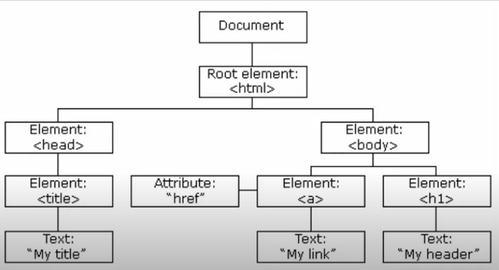

|참고자료|
|--|
|[자바스크립트 DOM & EVENT](https://youtu.be/uK6uExrg7Ww)|

# 1. 노드에 접근하기
## DOM
- Document Object Model
- HTML 문서의 각 요소들을 트리형식으로 나타냄  

- 위 그림에서 하나의 객체를 노드라고 함
- 모든 HTML 태그는 객체
### 노드 접근
- id값으로 접근
```
const el = document.getElementById('id값'); //id는 고유값이므로 'Element'
```
- tag 이름으로 접근
```
const pList = document.getElementsByTagName('Tag이름'); //tag이름은 중복가능하므로 'Elements'
```
- Class 이름으로 접근
```
document.getElementsByClassName('Class이름');
```
-  `querySelectorAll` 사용  
→ `querySeletor` : 제일 처음 나오는 요소 반환  
→ 반환값 : NodeList(배열은 아니지만 Literable한 컬렉션으로 인덱스 사용 가능)
```
document.querySelectorAll('.link'); //Class 이름으로 접근
document.querySelectorAll('#first');    //id값으로 접근
document.querySelector('#first');   //id값은 고유값이므로 All 제외해도 됨
```

# 2.부모, 자식, 형제 노드
## `querySelectorAll()` VS `getElementsByTagName()`
**[`querySelectorAll()`]**
- 반환값 : NodeList
- 한 번 저장된 값을 계속 사용

**[`getElementsByTagName()`]**
- 반환값 : HTMLCollection
- 노드의 변경사항 실시간 반영

## 부모 노드
**[`parentNode`]**
- 부모 노드 중 모든 타입의 노드 반환
- 반환값 : NodeList

**[`parentElement`]**
- 부모 노드 중 요소 노드만 반환
- 반환값 : HTMLCollection

## 자식 노드
**[`childNodes`]**
- 자식 노드 중 모든 타입의 노드 반환
- 반환값 : NodeList
- 반환값이 NodeList이지만 변경사항이 실시간 반영됨

**[`children`]**
- 자식 노드 중 요소 노드만 반환
- 반환값 : HTMLCollection

**[`firstChild`]**
- 자식 노드 중 첫번째 노드 반환

**[`lastChild`]**
- 자식 노드 중 마지막 노드 반환

**[`firstElementChild`]**
- 자식 노드 중 첫번째 요소 노드 반환

**[`lastElementChild`]**
- 자식 노드 중 마지막 요소 노드 반환

## 형제 노드
**[`previousSibling`]**
- 형제 노드 중 이전 노드 반환

**[`nextSibling`]**
- 형제 노드 중 다음 노드 반환

**[`previousElementSibling`]**
- 형제 노드 중 이전 요소 노드 반환

**[`nextElementSibling`]**
- 형제 노드 중 다음 요소 노드 반환


# 3. 노드 생성, 추가, 복제, 삭제
## 노드 수정
**[nodeValue]**
- 텍스트 노드에서만 `nodeValue`를 사용하여 텍스트 수정 가능
```
const blueTextNode = blue.firstChild;
blueTextNode.nodeName;  //'#text'
blueTextNode.nodeType;  //3
blueTextNode.nodeValue;  //'Blue'

blueTextNode.nodeValue = '파랑';    //NodeValue 사용하여 수정
```
**[textContent]**
- 텍스트 노드가 아닌 경우에도 값 수정 가능
- 마크업 날아가기 때문에 잘 사용하지 않음
```
const ul = document.getElementById('color');
ul.nodeType;    //1
ul.nodeName;    //'UL'
ul.nodeValue;   //null
ul.textContent; //'\n   Red\n   \n  Blue\n  Green\n'

ul.textContent = '<li>RED</li>' //마크업 적용되지 않음
```

**[innerHTML]**
- 마크업 적용
- 요소에 수정사항이 생길 때마다 다시 다 작성해야 함

## 노드 생성
1) `innerHTML` 사용
```
const newLi = document.createElement('li'); //새 요소 생성
newLi.innerHTML = 'green';  //innerHTML을 사용하여 텍스트 노드 생성
newLi;  //<li>green</li>
const ul = document.getElementById('color');
ul.appendChild(newLi);  //기존 ul에 방금 생성한 li 추가
```
2) `createTextNode` 사용
```
const newLi2 = document.createElement('li');
const newText = document.createTextNode('pink');    //텍스트노드 생성
newText;    //"pink"
newLi2.appendChild(newText);
ul.appendChild(newLi2);
```
.jpg)
.jpg)
.jpg)

3) `insertBefore(추가할 노드, 삽입할 위치 다음의 노드)` : 원하는 위치에 노드 삽입

```
const newLi3 = document.createElement('li');
const textNode3 = document.createTextNode('black');
newLi3.appendChild(textNode3);
const red = document.getElementById('red');
ul.insertBefore(newLi3, red);   //newLi3가 red 앞에 삽입
```

## 노드 복제
**[`cloneNode()`]**
- 인자로 아무 값도 안 넣거나, false를 전달하면 노드 자신만 덜렁 복제됨
- 인자로 true를 넣으면 자식 노드까지 복제

## 노드 삭제
**[`removeChild()`]**
- 노드 삭제

# 4. CSS style, class 제어
## class 제어
1) `className` 사용
- 기존 클래스 유지하면서 새 클래스를 추가하려면 다 작성해야함
- 잘 사용하지 않음

2) `classList` 사용
- add 메소드로 클래스 추가 가능(여러 개 추가할 경우 쉼표로 구분)
- remove 메소드로 클래스 제거 가능
- replace 메소드로 클래스 변경 가능
- toggle 메소드로 해당 클래스가 없으면 추가, 있으면 빼는 기능 가능

# 5. 이벤트 핸들러
1) id와 onClick 활용
```
<button id="btn">클릭3</button>
<script>
    const el = document.getElementById('btn');
    el.onClick = alert('Hello');
</script>
```
2) `addEventListener` 활용
- 특정 이벤트가 발생하면 인자로 전달받은 함수 실행
- event 객체를 인수로 받음
```
//addEventListener 사용
<button id="btn2">클릭4</button>
<script>
    const el2 = document.getElementById('btn2');
    el2.addEventListener(click, () => {
        alert("hi");
    });
</script>
```
```
//event 객체 사용
<input id="txt" type="text"/>
<script>
    const input = document.getElementById("text");
    input.addEventListener("keyup", event => {
        console.log(event.key);
    });
</script>
```
# 6. 이벤트 버블링, 이벤트 위임
**[이벤트 버블링]**
- 자식 노드에서 발생한 이벤트가 부모 노드에게 전파되는 것
.jpg)
.jpg)
- 이벤트 버블링 방지하기 : `event.stopPropagation()`;

**[이벤트 위임]**
- 자신에게 발생한 이벤트를 다른 요소에서 처리하는 것(버블링 활용)
```
<ul id='list'>
    <li id="red" class="on">Red</li>
    <li id="blue">Blue</li>
    <li id="green">Green</li>
    <li id="pink">Pink</li>
</ul>
<script>
    const list = document.getElementById("list");
    const colors = list.children;

    function clickHandler(event){
        for (c of colors){
            c.classList.remove("on");   //기존에 있는 on 클래스 모두 제거
        }
        event.target.classList.add("on");   //이벤트가 발생한 요소에 on 클래스 추가
    }

    //document.getElementById("red").addEventListener("click", clickHandler);
    //document.getElementById("blud").addEventListener("click", clickHandler);
    //document.getElementById("green").addEventListener("click", clickHandler);
    //document.getElementById("pink").addEventListener("click", clickHandler);
    document.getElementById("list").addEventListener("click", clickHandler);    //li에서 발생한 이벤트가 ul(부모 노드)에 등록된 이벤트 핸들러 실행
</script>
```
- `event.target` : 이벤트를 발생시키는 요소
- `event.currentTarget` : 이벤트 핸들러가 등록된 요소
